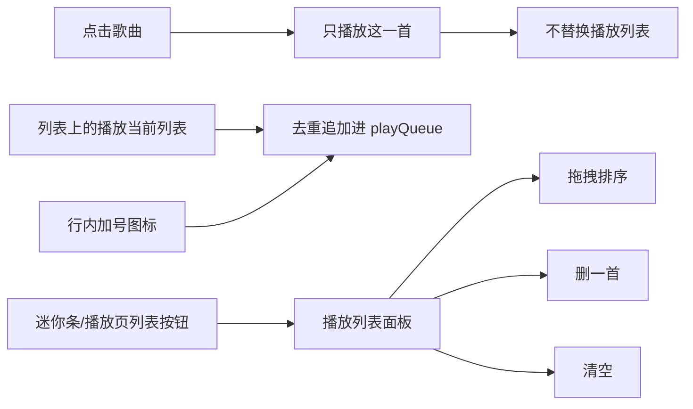

# 播放列表 + 我喜欢同步到 1300 首

点歌不再整表替换播放队列；迷你条和播放页打开可拖拽的当前播放列表（加入/删除/清空）。同步停在 499 是因为 QQ 分页在不足一页时提前结束，叠加 CgiGetDiss 约 500 首上限——改为按 total/hasmore 翻页，必要时换真实 tid 继续拉。

待办：

- playSong 不替换队列；add/remove/move/clear；列表加号与播放当前列表；迷你条+播放页打开可拖拽面板
- 按 total/hasmore 翻 QQ 我喜欢；不足一页不再当结束；500 后仍缺则用真实 tid 继续拉

## 一、当前播放列表是什么

现在点任何一首歌都会走 `playSong(song, 当前屏幕那一整份列表)`，把 [`playQueue`](../../src/stores/music-store.ts) **整表替换**成：

- 我喜欢 / 某个歌单 → `playlistTracks`
- 搜索 → `searchResults`
- 分类筛选 → 筛选结果

所以「默认播放列表」= **你最后点进去的那一屏列表**，上一首/下一首都围着它转。这和你要的「点歌只播这一首、队列自己管」是反的。

按你的选择改成：

### 点歌与加入

- **点击歌曲**：只调用 `playSong(song)`，不传 `queue`。若这首已在播放列表里，只更新 `currentIndex`；不在列表里也照样播，**不把当前列表塞进队列**。播完仍按 `playQueue` 下一首（队列为空则停）。
- **列表顶部「播放当前列表」**（图标 + 短提示，不要长文字）：把当前屏幕全部歌曲 **去重追加** 到 `playQueue`。若当前没在播，从该列表第一首开始播；若正在播，只加入不打断。
- **每行加号图标**（`ListPlus`/`Plus`，`stopPropagation`）：把这一首追加进队列（已存在则 toast「已在播放列表」）。

入口：[`SongList`](../../src/App.tsx)、分类列表 [`ClassifyTab.tsx`](../../src/ClassifyTab.tsx)。

### 播放列表面板

迷你条和全屏播放页各加一个 **列表图标按钮**（迷你条要 `stopPropagation`，避免点开变成进入播放页）。

面板（底部 sheet）：

- 显示 `playQueue`，当前曲高亮；点一行 = 跳到该曲播放（仍不替换队列）
- **拖拽调序**：左侧拖动手柄。不用 HTML5 DnD（Tauri 在 Windows 上要关 `dragDropEnabled` 才有 HTML5 拖放，会和系统拖文件冲突）。用 `pointer` 事件做手柄拖拽换位，手机比例窗口也好用。不新增 dnd 依赖。
- 每行删除图标；顶部 **清空**
- store 新方法：`addToQueue` / `removeFromQueue` / `moveInQueue` / `clearQueue` / `queueOpen`

改 [`playSong`](../../src/stores/music-store.ts)：去掉「传入 queue 就整表替换」这条路径（或仅内部切歌时保留不换队列）。`nextTrack` / `prevTrack` / `ended` 继续读 `playQueue`。

---

## 二、为什么同步只有 499 首

QQ 我喜欢走 `CgiGetDiss`（`dirid=201`）。前端 [`fetchAllLikedTracks`](../../src/stores/catalog-store.ts) 现在是：

1. 每页先要 **200** 首
2. 第一页如果不足 200，就把 `pageSize` 收成实际条数
3. **某一页返回少于 `pageSize` 就当结束**

QQ 这条接口常见上限大约 **500 首/次累计**。典型过程：200 + 200 + 约 99（500 附近，再扣掉 1 首映射失败）= **499**，然后被第 3 条规则提前掐断，**根本不会再请求 `song_begin=500` 之后**。官方 App 的 1300 是有的，是我们自己停早了。

`liked_hashes` 里写死 `song_num: 500` 也说明这条接口被当成 500 封顶来用。

### 修复

1. **分页停条件改掉**：Rust 的 `liked_playlist_tracks` / `qq_playlist_tracks_range` 带回 `total`（`total_song_num`）和 `hasmore`。前端循环直到 `已拉数量 >= total`，或 `hasmore === false` 且再翻一页仍为空。 **不足一页且仍小于 total 时继续翻**，不要 `break`。
2. **进度文案**：`已拉取 499 / 1300`，让缺页一眼能看出来。
3. **若 `song_begin >= 500` 之后 songlist 为空、但 total 仍是 1300**（接口真卡 500）：用创建歌单列表里 **dirid=201 的真实 `tid/dissid`**（现在被映射成 `"liked"` 丢掉了），走已有 [`playlist_tracks_legacy_range`](../../src-tauri/src/music_api/qqmusic.rs) 从 offset 500 继续拼。同步结束若仍 `count < total`，toast 明确说没拉全。
4. 手动再点「同步我喜欢」应能补上后半段（合并规则本来就不覆盖标签）。

---

## 主要改动文件

- [`src/stores/music-store.ts`](../../src/stores/music-store.ts) — 队列 API；点歌不换队列
- [`src/App.tsx`](../../src/App.tsx) / [`src/App.css`](../../src/App.css) — 列表按钮、迷你条/播放页入口、Queue sheet、拖拽
- [`src/ClassifyTab.tsx`](../../src/ClassifyTab.tsx) — 同样的加入/播放当前列表
- [`src/stores/catalog-store.ts`](../../src/stores/catalog-store.ts) + [`src-tauri/src/music_api/qqmusic.rs`](../../src-tauri/src/music_api/qqmusic.rs)（及 range 命令返回值）— 按 total/hasmore 拉全量
- [`doc/分类标签.md`](../分类标签.md) — 补一句同步可能超过 500

验证（NexMusic 窗口）：点歌不冲掉队列；加号/播放当前列表/拖拽/删除/清空；再同步 QQ 喜欢，条数应接近云端 1300 而不是停在 499。
